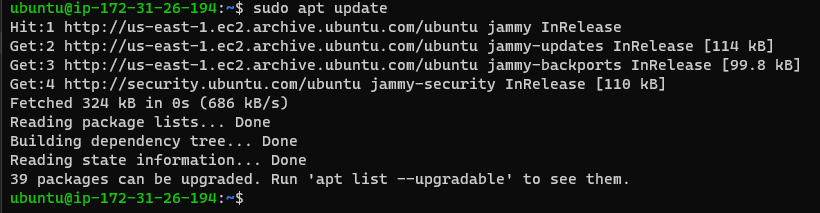

# Documentation of Project 1
## Web stack Implementation 
Step 1 Installing apache.
update a list of packages in package manager.

`sudo apt update`

run apache2 package installation.

`sudo apt install apache2`

Verify Apache2.

`sudo systemctl status apache2`

[Apache webpage](http://3.91.233.98/)

## Step 2
Installing mysql.

`sudo apt install mysql-server`
`sudo mysql`
`sudo mysql_secure_installation`
`sudo mysql -p`

## step_3

Step 3 Installing PHP.

`sudo apt install php libapache2-mod-php php-mysql`
`php -v`

Step 4 Creating a Virtual Host for your Website using Apache

`sudo mkdir /var/www/projectlamp`
`sudo chown -R $ubuntu:$ubuntu /var/www/projectlamp`
`sudo vi /etc/apache2/sites-available/projectlamp.conf`
`sudo ls /etc/apache2/sites-available`
`sudo a2ensite projectlamp`
`sudo a2dissite 000-default`
`sudo apache2ctl configtest`
`sudo systemctl reload apache2`

STEP 5 Enable PHP on the website

`sudo vim /etc/apache2/mods-enabled/dir.conf`
`sudo systemctl reload apache2`
`vim /var/www/projectlamp/index.php`
`sudo chown root:root index.php`
`sudo chmod 775 index.php`

[php version 8.1.2](http://3.91.233.98)
