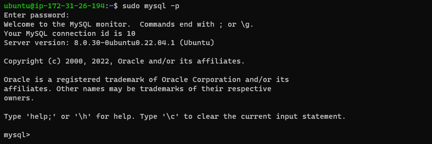

# Documentation of Project 1
## Web stack Implementation 
Step 1 Installing apache.
update a list of packages in package manager.

In linux, use `sudo apt update` to update linux packages.

run apache2 package installation.

In linux  use `sudo apt install apache2` to install apache2.

Verify Apache2.

In linux use `sudo systemctl status apache2`to confirm status.

[inline link](http://3.91.233.98/)

---

## Step 2
Installing mysql.

In linux use `sudo apt install mysql-server`

In linux use `sudo mysql`

In linux use `sudo mysql_secure_installation`

In linux use `sudo mysql -p`

---

## step_3

Step 3 Installing PHP.

In linux use `sudo apt install php libapache2-mod-php php-mysql`

In linux use `php -v`

---

Step 4 Creating a Virtual Host for your Website using Apache

`sudo mkdir /var/www/projectlamp`

`sudo chown -R $ubuntu:$ubuntu /var/www/projectlamp`

`sudo vi /etc/apache2/sites-available/projectlamp.conf`

`sudo ls /etc/apache2/sites-available`

`sudo a2ensite projectlamp`

`sudo a2dissite 000-default`

`sudo apache2ctl configtest`

`sudo systemctl reload apache2`

---

STEP 5 Enable PHP on the website

`sudo vim /etc/apache2/mods-enabled/dir.conf`

`sudo systemctl reload apache2`

`vim /var/www/projectlamp/index.php`

`sudo chown root:root index.php`

`sudo chmod 775 index.php`

[inline link](http://3.91.233.98)
